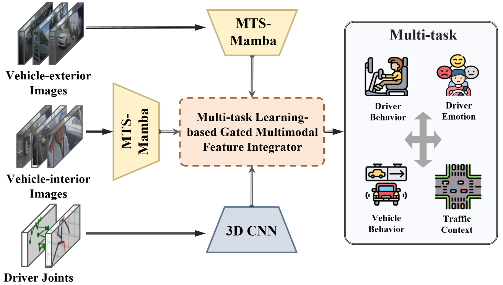

# TEM³-Learning: Time-Efficient Multimodal Multi-Task Learning Network for Assistive Driving

<div align="center">
  
</div>

## Introduction

TEM³-Learning (Time-Efficient Multimodal Multi-Task Learning Network for Assistive Driving) is a novel multimodal multi-task learning framework that leverages multimodal data to simultaneously recognize driver emotions, behaviors, traffic environments, and vehicle behaviors. Experiments on public ADAS datasets demonstrate that this framework achieves SOTA performance across all four tasks with less than 6M parameters.

## Environment Setup

### System Requirements

- Python 3.7+
- CUDA 11.0+ (for GPU acceleration)
- 24GB+ RAM

### Installation Steps

1.  **Clone the repository**

```bash
git clone https://github.com/Wenzhuo-Liu/TEM3-Learning.git
cd TEM3-Learning
```

2.  **Create a virtual environment**

```bash
# conda
conda create -n tem3 python=3.8
conda activate tem3
```

3. **Install dependencies**

```bash
pip install -r requirements.txt
```

## Dataset

The project is trained, validated, and tested using the AIDE dataset. For dataset-related files or more information, please search for "AIDE Dataset" online or visit its official repository.

##  Data Preprocessing

```bash
python Crop.py
```

## Usage

### Running the Model

```bash
python run_MG.py
```
